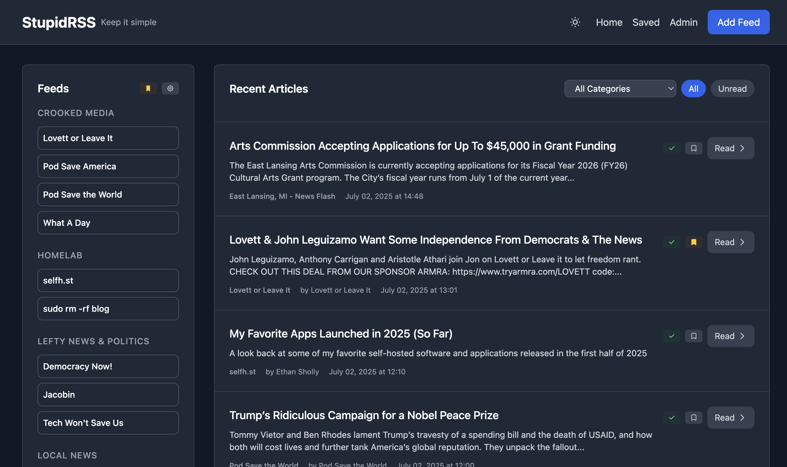
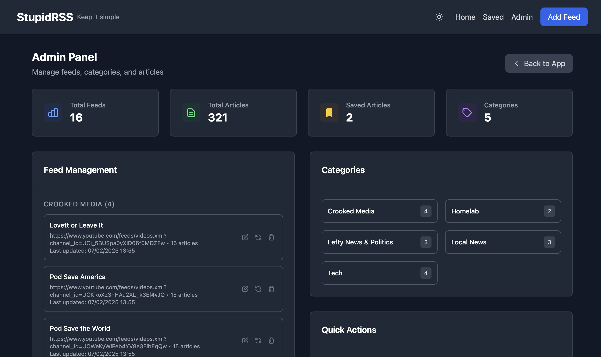

# StupidRSS

> **Vibe Coding Project Notice**
>
> This project is developed in a freeform, improvisational, and experimental style. **No pull requests will be honored.**
>
> If you have a feature request or bug, please [open an issue](https://github.com/dannycab/stupidrss/issues) and I'll vibe code it (maybe it works, maybe not). Thanks for understanding!

A fast, minimalistic RSS reader webapp built with FastAPI and Tailwind CSS.

🌐 **Live Demo**: [Documentation](http://dannycaballero.info/stupidrss)  
🔗 **GitHub**: https://github.com/dannycab/stupidrss

## Features

- 🚀 **Fast**: Built with FastAPI for high performance
- 🎨 **Modern UI**: Clean, responsive design with Tailwind CSS
- 📱 **Mobile-friendly**: Works great on all devices
- 🔄 **Real-time updates**: Async RSS parsing and fetching
- 💾 **SQLite database**: Lightweight, zero-config storage
- 🔗 **Easy feed management**: Add, remove, and refresh feeds with one click
- 🧹 **Smart Content Cleaning**: Automatically strips HTML tags while preserving formatting
- 📺 **YouTube-Optimized**: Removes spam and duplicate content from video feeds
- 🎯 **Enhanced UX**: Streamlined buttons, improved navigation, and consistent UI
- 🔍 **Filter Support**: Built-in article filtering and search capabilities
- 📂 **Category Organization**: Organize feeds by categories with dedicated category pages
- 🔖 **Advanced Filtering**: Filter articles by All, Unread, and Saved across all pages
- 🧭 **Intuitive Navigation**: Sidebar navigation on secondary pages, clean header design

## Tech Stack

- **Backend**: FastAPI (Python async web framework)
- **Frontend**: Jinja2 templates + Tailwind CSS
- **Database**: SQLite with SQLAlchemy ORM
- **RSS Parsing**: feedparser library
- **HTTP Client**: httpx for async requests

## Quick Start

1. **Install dependencies**:
   ```bash
   pip install -r requirements.txt
   ```

2. **Run the application**:
   ```bash
   python main.py
   ```

3. **Open your browser** and go to `http://localhost:8000`

4. **Add RSS feeds** and start reading!

## Docker Deployment

StupidRSS can be easily deployed using Docker with customizable environment variables.

### Quick Docker Setup

1. **Clone the repository**:
   ```bash
   git clone https://github.com/dannycab/stupidrss.git
   cd stupidrss
   ```

2. **Create your environment file** (optional):
   ```bash
   cp .env.example .env
   ```

3. **Customize your `.env` file** as needed:
   ```bash
   # Port to expose the application on
   PORT=8000
   
   # Python path inside the container
   PYTHONPATH=/app
   
   # Database URL (SQLite file path)
   DATABASE_URL=sqlite:///data/rss_reader.db
   
   # Data volume path (host side)
   DATA_VOLUME_PATH=./data
   
   # Container data path
   CONTAINER_DATA_PATH=/app/data
   ```

4. **Start the application**:
   ```bash
   docker-compose up -d
   ```

5. **Access your RSS reader** at `http://localhost:8000` (or your configured port)

### Environment Variables

| Variable | Default | Description |
|----------|---------|-------------|
| `PORT` | `8000` | Port to expose the application on your host |
| `PYTHONPATH` | `/app` | Python path inside the container |
| `DATABASE_URL` | `sqlite:///data/rss_reader.db` | Database connection string |
| `DATA_VOLUME_PATH` | `./data` | Host directory for data persistence |
| `CONTAINER_DATA_PATH` | `/app/data` | Container directory for data storage |

### Docker Features

- **Zero Configuration**: Works out of the box with sensible defaults
- **Data Persistence**: SQLite database and data stored in mounted volume
- **Environment Flexibility**: Customize ports, paths, and database location
- **Health Checks**: Built-in health monitoring for container status
- **Automatic Restart**: Container restarts automatically unless manually stopped

The `.env` file is not committed to the repository, allowing you to customize your deployment without affecting the codebase.

## Screenshots

### Main Page - Feed Overview


### Article Reading Experience  


### Admin Panel - Feed Management


### Saved Articles


## API Routes

- `GET /app` - Main RSS reader application
- `GET /docs` - Interactive OpenAPI documentation
- `GET /redoc` - Alternative API documentation

### 🔗 **REST API Endpoints:**
- `GET /api/feeds` - List all feeds
- `GET /api/feeds/{id}` - Get specific feed
- `GET /api/articles` - Recent articles  
- `GET /api/feeds/{id}/articles` - Feed-specific articles
- `PUT /api/feeds/{id}` - Update feed metadata
- `POST /feeds/add` - Add new feed
- `DELETE /feeds/{id}` - Delete feed
- `POST /feeds/{id}/refresh` - Refresh feed

### 📂 **Page Routes:**
- `GET /` - Main feed and article overview
- `GET /categories` - Categories overview with article previews
- `GET /categories/{category}` - Individual category article listings
- `GET /saved` - Saved articles page
- `GET /articles/{id}` - Individual article view
- `GET /admin` - Feed management and admin panel

## Development

### Running in development mode:
```bash
uvicorn main:app --reload --host 0.0.0.0 --port 8000
```

### Project Structure:
```
stupidrss/
├── main.py              # FastAPI application entry point
├── models/              # Database models
│   ├── database.py      # Database configuration
│   └── models.py        # SQLAlchemy models
├── services/            # Business logic
│   └── rss_service.py   # RSS parsing and feed management
├── templates/           # Jinja2 HTML templates
│   ├── base.html        # Base template
│   ├── index.html       # Home page
│   └── feed_articles.html # Feed-specific articles
├── static/              # Static assets
│   └── style.css        # Custom CSS
└── requirements.txt     # Python dependencies
```

## Adding Feeds

Simply click "Add Feed" and paste any RSS/Atom feed URL. The app will:
- Validate the feed
- Extract feed metadata
- Fetch initial articles
- Start tracking updates
- Automatically clean HTML content for better readability
- Remove duplicate descriptions and spam content

## Content Features

**Smart Content Cleaning**: StupidRSS automatically processes all article content to:
- Strip HTML tags while preserving formatting (lists, paragraphs, line breaks)
- Remove YouTube spam and promotional content
- Eliminate duplicate descriptions
- Convert HTML entities to readable text
- Maintain proper list formatting with bullets and numbering

**Enhanced User Experience**:
- Standardized "Add Feed" and "Delete" buttons across all pages
- Enhanced delete confirmation requiring "DELETE" to be typed
- Streamlined feed display on the home page
- Working filter buttons for article management
- Consistent UI styling and responsive design

## Category Management

**Organize Your Feeds**: StupidRSS now includes comprehensive category support:

**Categories Overview** (`/categories`):
- View all categories with recent articles (5 per category)
- Filter by All, Unread, or Saved articles across categories
- Click category names to view all articles in that category
- Clean sidebar navigation for easy access to other sections

**Individual Category Pages** (`/categories/{category}`):
- Full article listings for specific categories
- Same filtering options as main page (All, Unread, Saved)
- Sidebar shows all feeds within that category
- Maintains all read/save functionality from main page

**Navigation Structure**:
- **Main Page**: Full top navigation with Categories, Saved, Admin links
- **Secondary Pages**: Clean header with sidebar navigation
- **Consistent Experience**: Same functionality across all pages
- **Responsive Design**: Adapts beautifully to all screen sizes

## API Endpoints

- `GET /` - Home page with all feeds and recent articles
- `POST /feeds/add` - Add a new RSS feed
- `POST /feeds/{feed_id}/refresh` - Refresh a specific feed
- `DELETE /feeds/{feed_id}` - Delete a feed
- `GET /feeds/{feed_id}/articles` - View articles from a specific feed

## Contributing

This is a "vibe coding" project - feel free to fork and customize to your heart's content!

## License

MIT License - do whatever you want with it!
